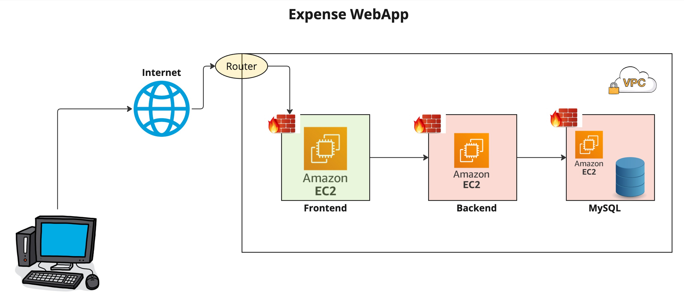

# Expense-App Anatomy

Expense is a 3 tier web application used to list down our daily expenses and this is developed by using the below 3 technologies 

    * Frontend :    Developed by using ReactJS
    * Backend  :    Developed by using NodeJS 
    * DB       :    MySQL 

Expected applicaiton is designed to be running on AWS Cloud in N.Virginia Region and ensure you deploy all of them on the top of the below AMI

```
    AMI To Use  : DevOps-LabImage-RHEL9
    Region      : N.Virginia
    Credentials : ec2-user/DevOps321
```

On a high-level here is how the architecture and the flow looks like: 



Once you create 3 servers using t3.micro on N.Virginia using the above image make sure you attach a security create named `b58-allow-all` that allows `all-inbound` from `0.0.0.0/0` proceed with `001-frontend`